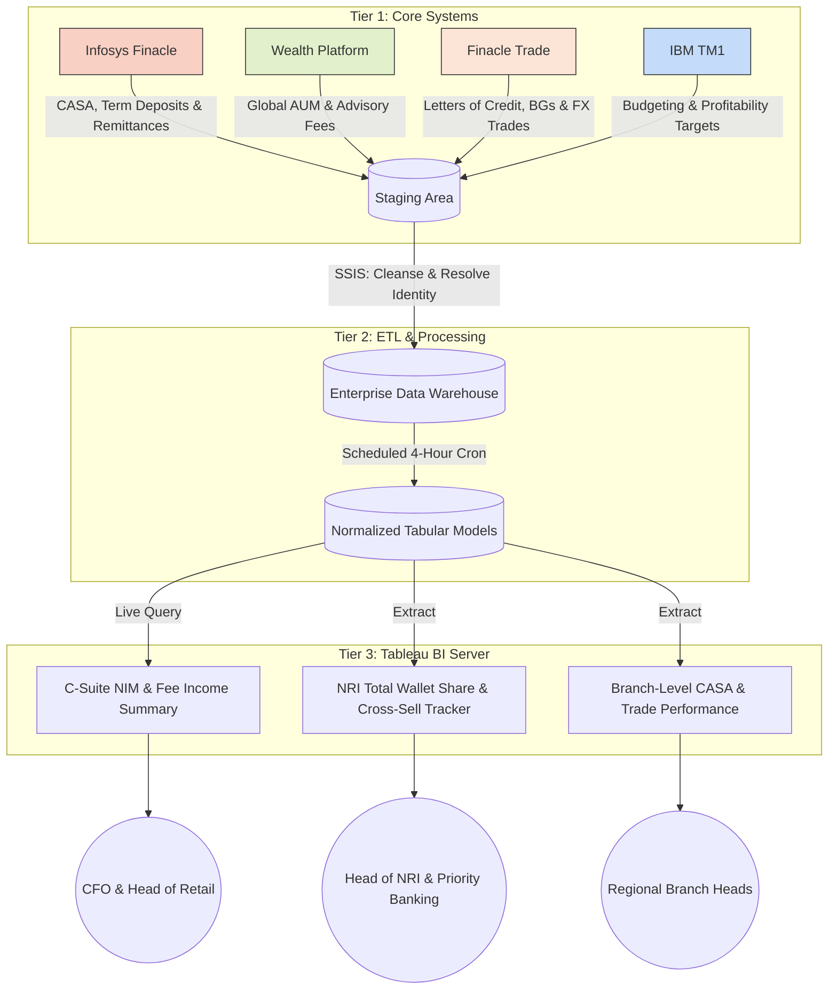

# 🏦 Strategic Architecture: Real-Time Liability, Wealth & NRI Trade Finance BI Suite

> **Client:** Federal Bank (Sanitized) | **Timeline:** Apr 2024 - Dec 2025
> **Role:** Senior Product Manager & Finance Strategist
> **Domain Focus:** NRI Cross-Border Wealth, Trade Finance Fee Income, Cost of Funds (CoF), CASA Ratio
> **Core Stack:** Infosys Finacle (CBS), Avaloq (Wealth), Finacle Trade Connect, IBM TM1, SQL Server, Tableau

## 1. Executive Summary (SCQA)
*   **Situation:** Federal Bank’s Priority Banking division was managing a highly lucrative but fragmented NRI (Non-Resident Indian) portfolio. While RMs tracked domestic deposits, they were blind to their clients' global wealth and cross-border corporate operations.
*   **Complication:** High-net-worth NRIs frequently utilize Trade Finance (Letters of Credit, Bank Guarantees, FX remittances) for their cross-border businesses. Because Trade Finance and Retail Wealth operated on disconnected T+3 day legacy reports, RMs were missing massive cross-sell opportunities, bleeding lucrative Non-Interest Revenue (Fee Income & FX spreads) to competitor banks.
*   **Question:** How do we unify Core Banking, Wealth Management, and Corporate Trade Finance data to give RMs a 360-degree view of an NRI’s total cross-border wallet share, driving both NIM and Fee Income?
*   **Answer:** Architected a near real-time BI and FP&A data pipeline that bridged Retail Liabilities with Corporate Trade Finance. This unified platform empowered 150+ Priority RMs to lower the Cost of Funds via CASA optimization while simultaneously triggering high-margin Trade Finance and FX cross-sells, rescuing an estimated INR 25+ Cr in AUM and driving a measurable lift in global fee income.

## 2. The Financial & Operational ROI
*Minto Principle: Outcomes precede mechanics. The following metrics were validated by the Office of the CFO.*

| Strategic Lever | Legacy State | Production State | Enterprise Profitability Impact |
| :--- | :--- | :--- | :--- |
| **Trade & FX Fee Income** | Siloed / Reactive | **Trigger-Based** | Correlated NRI wealth balances with corporate trade data, equipping RMs to intercept competitor FX transfers and LC issuances, driving a direct lift in Non-Interest Revenue. |
| **Cost of Funds (CoF)** | End-of-Month | **Intra-Day Tracking** | Enabled targeted Priority Banking campaigns that optimized the deposit mix, contributing to a **12 bps reduction in blended CoF**. |
| **AUM / Churn Mitigation** | 72 Hours (T+3) | **< 4 Hours** | Alerted RMs to high-value withdrawal and remittance patterns instantly, rescuing an estimated **INR 25+ Cr** in Priority Banking AUM. |

## 3. System Architecture & Data Flow
Integrating high-velocity retail deposits, complex wealth portfolios, and corporate trade ledgers required a robust, decoupled data tiering strategy to ensure zero performance degradation on core operations.

## 4. Engineering Constraints & Product Friction
Driving multi-product profitability required navigating severe internal data silos and complex identity resolution challenges.

### ADR 1: Corporate-to-Retail Identity Resolution (The NRI Bridge)
*   **The Friction:** Trade Finance records are mapped to *Corporate Entities* (e.g., "Sharma Exports LLC"), while Wealth and CASA accounts are mapped to *Retail Individuals* (e.g., "Rajiv Sharma"). Standard relational joins failed, leaving RMs blind to the corporate operations of their retail HNI clients.
*   **The Solution:** Engineered a probabilistic identity-resolution pipeline within the EDW. We built a `Dim_Global_Household` table that utilized fuzzy matching on directorship PAN cards, registered NRI addresses, and remittance origins. This successfully bridged the Corporate/Retail divide, proving to RMs that their $500k deposit client also controlled a $5M annual FX pipeline.

### ADR 2: The Funds Transfer Pricing (FTP) Truce
*   **The Friction:** Retail Banking and Corporate Treasury were locked in a dispute over who "owned" the profit margin of NRI deposits versus the FX spread on their remittances. 
*   **The Solution:** Applied JAIIB-level domain expertise to hardcode a standardized Funds Transfer Pricing (FTP) model directly into the SQL semantic layer. By mathematically locking the spread credit between the branch (liability generator) and treasury (fund user) before it hit Tableau, we eliminated executive "spreadsheet wars" and aligned all divisions on a single source of profitability truth.

## 5. 📂 Interactive Portfolio Assets
To examine the underlying architecture and product management artifacts, please review the sanitized files in the `/assets` directory of this repository:

*   `01_corporate_retail_identity_bridge.sql`: Sanitized DDL/DML schemas demonstrating the fuzzy logic used to link Corporate Trade Finance entities to Retail NRI Wealth profiles.
*   `02_nri_wallet_share_wireframes.fig`: High-fidelity UX flows of the RM dashboard, showing how low-yield CASA balances trigger automated FX and LC advisory prompts.
*   `03_ftp_governance_matrix.pdf`: The standardized Funds Transfer Pricing mathematical logic applied to reconcile Retail, Trade, and Treasury P&L disputes.
*   `04_architecture_adr_log.md`: Deep-dive into the SQL pipeline scheduling required to handle high-frequency retail transactions alongside complex, multi-currency trade documents.
