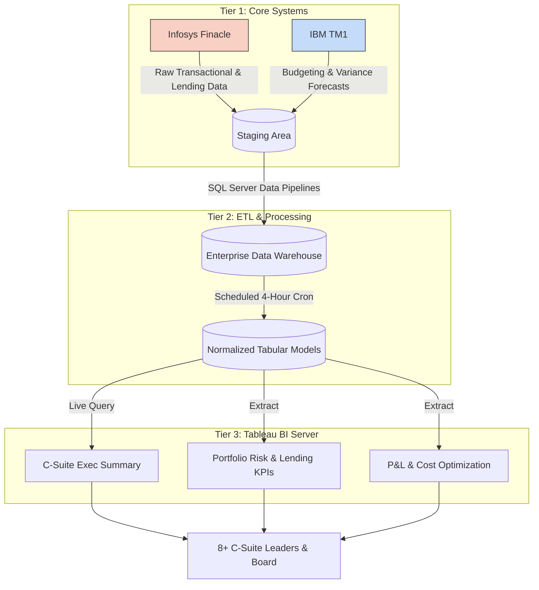

# 🏦 Strategic Architecture: Real-Time FP&A & Executive BI

> **Client:** Federal Bank (Sanitized) | **Timeline:** Apr 2024 - Dec 2025
> **Role:** Senior Product Manager & Finance Strategist
> **Core Stack:** Infosys Finacle (CBS), IBM TM1, SQL Server (ETL/DWH), Tableau Server

## 1. Executive Summary (SCQA)
*   **Situation:** Federal Bank’s 8+ C-suite leaders were steering a highly dynamic commercial lending portfolio using fragmented, manually consolidated Excel MIS reports. 
*   **Complication:** Data latency was locked at 72 hours (T+3). In commercial lending, 72-hour-old data is not a reporting delay; it is an unmitigated risk constraint. The bank was reacting to slippage rather than managing it, delaying interventions on Non-Performing Assets (NPAs).
*   **Question:** How do we transition executive steering from reactive, labor-intensive spreadsheets to a predictive, near real-time pipeline without disrupting the Core Banking System?
*   **Answer:** Architected and deployed an automated BI and FP&A dashboard suite bridging Infosys Finacle and IBM TM1. This pipeline reduced risk-signal response time by 70% (<4 hours) and established the real-time data foundation required for the Board to execute INR 10–15 Cr capital allocations safely.

## 2. The Financial & Operational ROI
*Minto Principle: Outcomes precede mechanics. The following metrics were validated by the Office of the CFO.*

| Strategic Lever | Legacy State | Production State | Enterprise Impact |
| :--- | :--- | :--- | :--- |
| **Risk Signal Latency** | 72 Hours (T+3) | **< 4 Hours** | **70% reduction in response time.** Shifted NPA management from reactive provisioning to proactive restructuring. |
| **Capital Deployment** | Monthly Arrears | **Real-Time** | Enabled data-backed, Board-level investment decisions of **INR 10–15 Cr** within intra-day sprint cycles. |
| **OpEx & Labor** | Manual Aggregation | **Automated** | Reclaimed **400+ hours annually**, shifting FP&A analysts from ETL drudgery to variance modeling. |

## 3. System Architecture & Data Flow
Integrating high-frequency transactional data (Finacle) with multidimensional forecasting cubes (TM1) required strict tiering to protect the production core.

## 4. Engineering Constraints & Product Friction
Shipping this suite required navigating intense technical debt and conflicting stakeholder incentives.

### ADR 1: The Finacle/TM1 Bridge
*   **The Friction:** Finacle outputs highly relational, transactional row-data. TM1 operates in multidimensional OLAP cubes. Standard Tableau joins caused catastrophic query failures.
*   **The Solution:** Engineered a dedicated SQL intermediary layer to flatten TM1 budget data and map it against aggregated Finacle branch-level dimensions, allowing Tableau to consume a pre-computed Star Schema.

### ADR 2: Stakeholder Alignment via JAIIB Standards
*   **The Friction:** 8+ C-level executives (CRO, CFO, Head of Lending) possessed conflicting mathematical definitions for "Cost of Funds" and "Capital Adequacy." 
*   **The Solution:** Leveraged my JAIIB-certified domain expertise to act as the ultimate tie-breaker. Standardized a unified KPI dictionary aligned strictly with RBI internal audit standards. If a metric definition didn't meet regulatory rigor, it did not enter the SQL pipeline.

## 5. 📂 Interactive Portfolio Assets
To examine the underlying architecture and product management artifacts, please review the sanitized files in the `/assets` directory of this repository:

*   `01_architecture_adr_log.md`: Deep-dive into the SQL pipeline scheduling used to prevent Finacle read-locks.
*   `02_tableau_executive_wireframes.fig`: High-fidelity UX flows demonstrating the drill-down logic from P&L Variance to individual loan health.
*   `03_kpi_governance_matrix.pdf`: The standardized mathematical logic applied to reconcile Risk and Finance metrics.
*   `04_tm1_sql_integration.sql`: Sanitized DDL schemas demonstrating the data modeling used to merge forecasting and transactional datasets.
